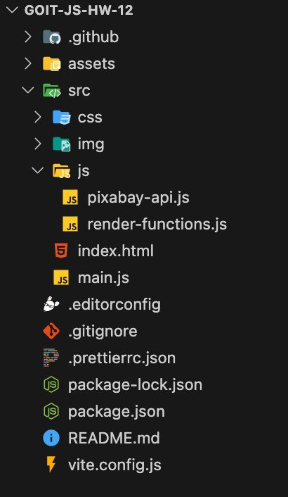

# Домашнє завдання №12

## Загальні вимоги

1. Створи репозиторій **goit-js-hw-12**.
2. Збери проєкт за допомогою [**Vite**](https://vite.dev/). Ми підготували для
   тебе [готову збірку](https://github.com/goitacademy/vanilla-app-template) з
   усіма необхідними налаштуваннями — рекомендуємо використовувати саме її.
3. Для HTTP-запитів використовуй бібліотеку
   [**Axios**](https://axios-http.com/).
4. Використовуй синтаксис **async/await**.
5. Прочитай завдання та виконай його в редакторі коду.
6. Переконайся, що код відформатований за допомогою **Prettier**, а в консолі
   відсутні помилки та попередження під час відкриття живої сторінки.
7. Здай домашнє завдання на перевірку.

### Формат здачі

Домашня робота повинна містити **два посилання**:

- на вихідні файли репозиторію;
- на робочу сторінку на **GitHub Pages**.

> ⚠️ **Зверни увагу!** Імена файлів і папок, а також структура вкладеності мають
> відповідати вказаній схемі. В іншому разі робота **не буде прийнята**.

---

## Структура та організація коду

Для організації коду використовуй **модульність** та синтаксис
`export / import`.

### `pixabay-api.js`

У цьому файлі зберігай функції для виконання HTTP-запитів:

- **getImagesByQuery(query, page)**
  - `query` — пошукове слово (рядок);
  - `page` — номер сторінки (число);
  - функція виконує HTTP-запит і повертає значення властивості `data` з
    отриманої відповіді.

### `render-functions.js`

У цьому файлі:

- створи екземпляр **SimpleLightbox** для роботи з модальним вікном;
- реалізуй функції для відображення елементів інтерфейсу:

  - **createGallery(images)** Приймає масив `images`, створює HTML-розмітку
    галереї, додає її в контейнер та викликає метод `refresh()` екземпляра
    **SimpleLightbox**.

  - **clearGallery()** Очищує вміст контейнера галереї.

  - **showLoader() / hideLoader()** Показує та приховує індикатор завантаження.

  - **showLoadMoreButton() / hideLoadMoreButton()** Показує та приховує кнопку
    **Load more**.

Усі функції нічого не повертають.

### `main.js`

- Містить **усю логіку роботи додатка**.
- Саме тут:
  - викликаються нотифікації **iziToast**;
  - виконуються перевірки на довжину масиву в отриманій відповіді;
  - реалізується логіка **пагінації** та **прокручування сторінки (scroll)**.
- Імпортуй функції з `pixabay-api.js` та `render-functions.js` і викликай їх у
  відповідний момент.

---

## Завдання — Пошук зображень

Використовуй код із домашньої роботи попереднього модуля та **доповни застосунок
новим функціоналом**.

Для стилізації використовуй наданий
[макет](https://www.figma.com/file/m8k9NQV7qZrtYDCvxfD68B/%D0%94%D0%97-JavaScript?type=design&node-id=3-1010&mode=design&t=eCh8cUwdfWOakuAr-0)
(або власні стилі).

---

## Рефакторинг

- Застосуй синтаксис **async/await** для роботи з асинхронними запитами.
- Виконай рефакторинг коду попередньої домашньої роботи.

---

## Пагінація

API **Pixabay** підтримує пагінацію через параметри `page` і `per_page`.

### Вимоги:

- У кожній відповіді має приходити **15 зображень** (`per_page = 15`).
- Початкове значення `page` — **1**.
- Після кожного наступного запиту `page` збільшується на **1**.
- При новому пошуковому запиті значення `page` потрібно **скидати до 1**.

### Кнопка Load more

- Додай у HTML кнопку з текстом **Load more** після галереї.
- При кліку на кнопку виконується запит за наступною сторінкою зображень.
- Нові зображення додаються до вже існуючих у галереї.
- Пошуковий запит користувача зберігай у **глобальній змінній**.

#### Логіка відображення кнопки:

- Якщо зображень ще немає — кнопка прихована.
- Після першого успішного запиту кнопка з’являється.
- При повторному сабміті форми кнопка спочатку ховається, а потім з’являється за
  потреби.
- Індикатор завантаження має бути **під кнопкою Load more**.

Переглянь
[демо-відео роботи застосунку на цьому етапі](https://www.youtube.com/watch?v=00hLHI3hx28&embeds_referring_euri=https%3A%2F%2Fwww.edu.goit.global%2F&embeds_referring_origin=https%3A%2F%2Fwww.edu.goit.global&source_ve_path=OTY3MTQ).

---

## Кінець колекції

У відповіді бекенд повертає властивість **totalHits** — загальну кількість
зображень, що відповідають запиту.

Якщо користувач дійшов до кінця колекції:

- приховай кнопку **Load more**;
- відобрази повідомлення:

`We're sorry, but you've reached the end of search results.`

Зверни увагу, що кінець колекції може бути як на **першій сторінці**, так і на
**будь-якій наступній**.

Переглянь
[демо-відео роботи застосунку на цьому етапі](https://www.youtube.com/watch?v=0ZQVWxm0VcQ&embeds_referring_euri=https%3A%2F%2Fwww.edu.goit.global%2F&embeds_referring_origin=https%3A%2F%2Fwww.edu.goit.global&source_ve_path=OTY3MTQ).

## Прокручування сторінки

Реалізуй **плавне прокручування сторінки** після кожного запиту та відтворення
наступної групи зображень.

Для цього:

1. Отримай висоту однієї карточки галереї, використовуючи метод
   [`getBoundingClientRect`](https://developer.mozilla.org/en-US/docs/Web/API/Element/getBoundingClientRect).
2. Після додавання нових елементів виконай прокручування сторінки методом
   [`window.scrollBy`](https://developer.mozilla.org/en-US/docs/Web/API/Window/scrollBy)
   на **дві висоти карточки галереї**.

Переглянь
[демо-відео роботи застосунку на цьому етапі](https://www.youtube.com/watch?v=aEhYvL7wIV8&embeds_referring_euri=https%3A%2F%2Fwww.edu.goit.global%2F&embeds_referring_origin=https%3A%2F%2Fwww.edu.goit.global&source_ve_path=OTY3MTQ).

---

## На що буде звертати увагу ментор при перевірці

- Домашня робота містить **два посилання**:
  - на вихідні файли репозиторію;
  - на живу сторінку на **GitHub Pages**
- Проєкт зібраний за допомогою [**Vite**](https://vite.dev/)
- Консоль в інструментах розробника **не містить помилок, попереджень та
  console.log**
- Елементи сторінки стилізовані згідно з макетом (або використані власні стилі)
- Проєкт містить код із попередньої домашньої роботи
- У файлі `pixabay-api.js` є функція `getImagesByQuery(query, page)` для
  виконання HTTP-запитів
- У файлі `render-functions.js`:
  - створено екземпляр **SimpleLightbox**;
  - реалізовані функції:
    - `createGallery(images)`
    - `clearGallery()`
    - `showLoader()`
    - `hideLoader()`
    - `showLoadMoreButton()`
    - `hideLoadMoreButton()`
- У файлі `main.js` описана **вся логіка роботи застосунку**
- Усі асинхронні запити реалізовані з використанням **async/await**
- За один HTTP-запит у відповідь приходить **15 елементів**
- Нові зображення додаються в DOM **за одну операцію**
- Під галереєю присутня кнопка **Load more**, при кліку на яку виконується запит
  на наступну сторінку
- Після додавання нових зображень викликається метод `SimpleLightbox.refresh()`
- Коли користувач доходить до кінця колекції:
  - кнопка **Load more** зникає;
  - з’являється відповідне повідомлення
- При кожному новому сабміті форми:
  - номер сторінки скидається до значення **1**;
  - результати попереднього пошуку очищаються
- При кліку на маленьке зображення в галереї відкривається його **збільшена
  версія** у модальному вікні з використанням **SimpleLightbox**

  ***

**Жива сторінка: [GitHub Pages](https://akinaru72.github.io/goit-js-hw-12/)**
